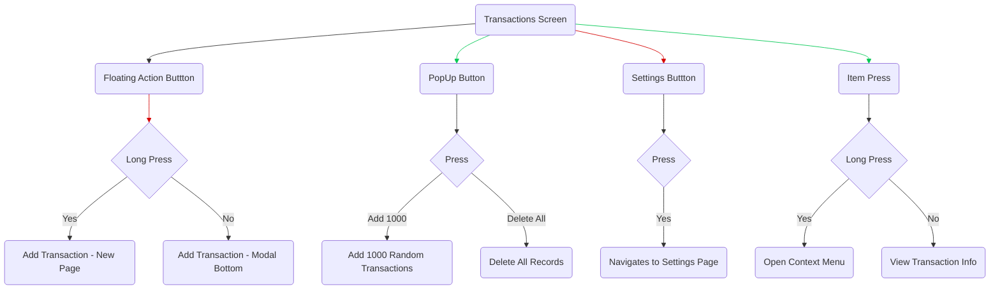

# Test Project


### Flutter SDK Version: `3.22.2`
### Dart Version: `3.4.3`
### DevTools Version: `2.34.3`
<hr>


## Step for Running Application
1-Import project from github

2-In project root, open a terminal and run:
``` bash
flutter pub get
```
``` bash
flutter gen-l10n
```
if you have error, run:
``` bash
dart run build_runner build
```

3-Run app by your IDE in Emulator.
<hr>


### Splash Screen

